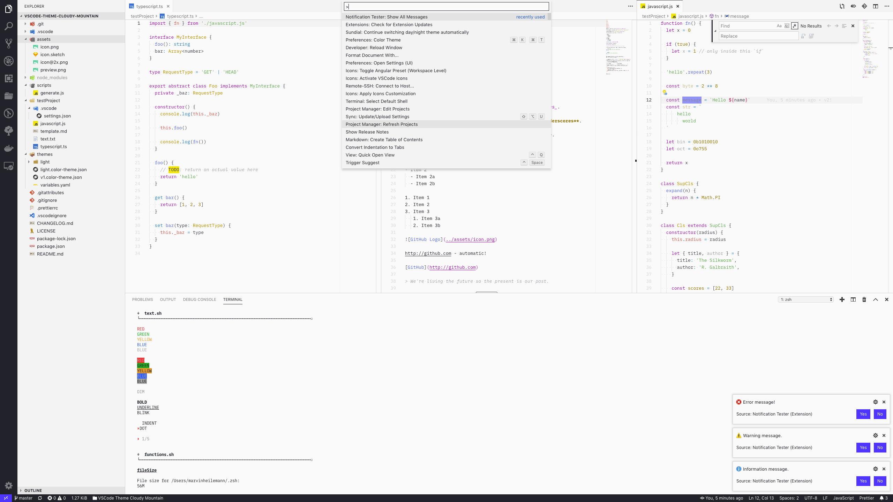

<h1 align="left">
  
  <b>🌁 Cloudy Mountain 🌁</b>
</h1>

#### A modern cloudy mountain inspired theme for [VS Code](https://code.visualstudio.com/) with simple colors

## 

---

## ☁️ Installation

You can easily install this VS Code Theme trough the VS Code Marketplace:

## 
